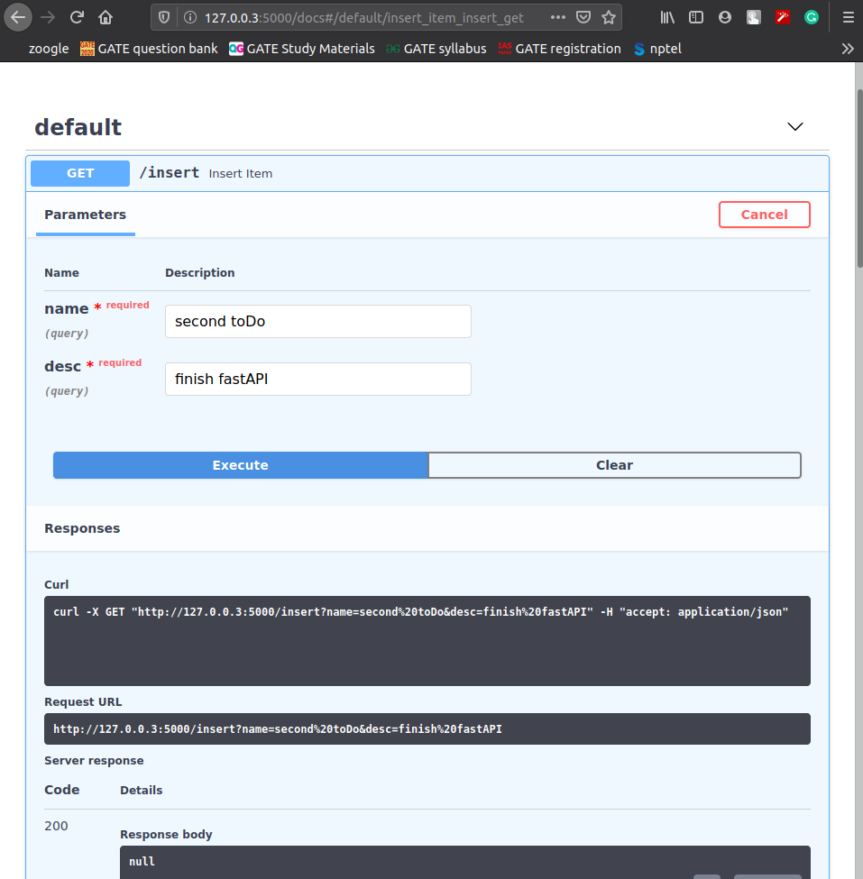
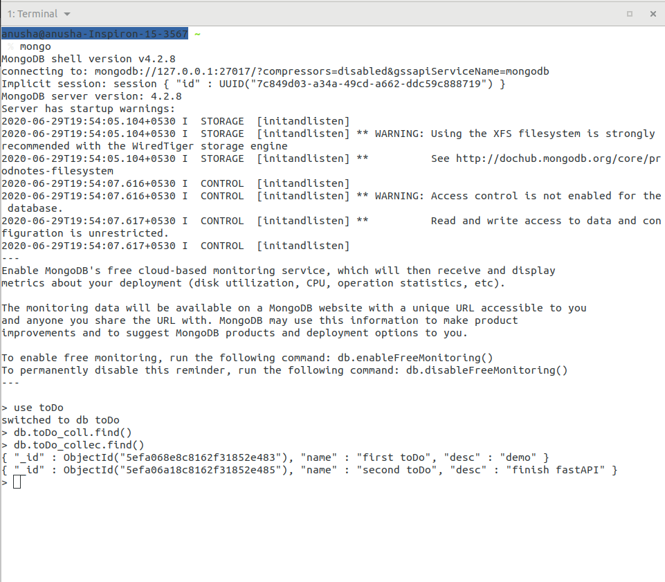
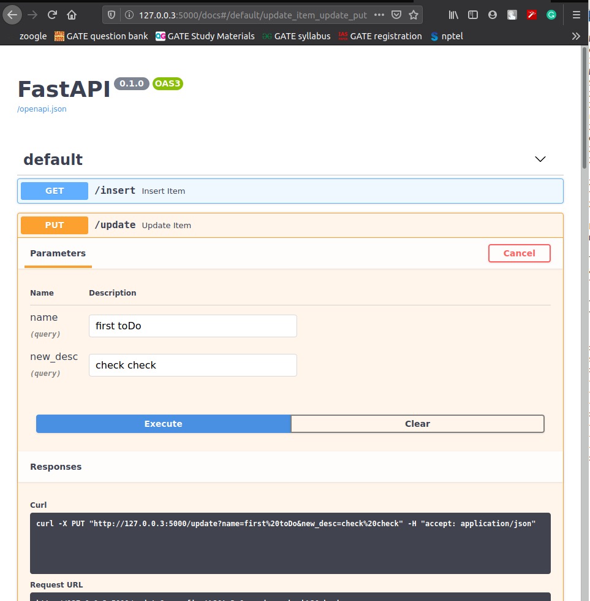
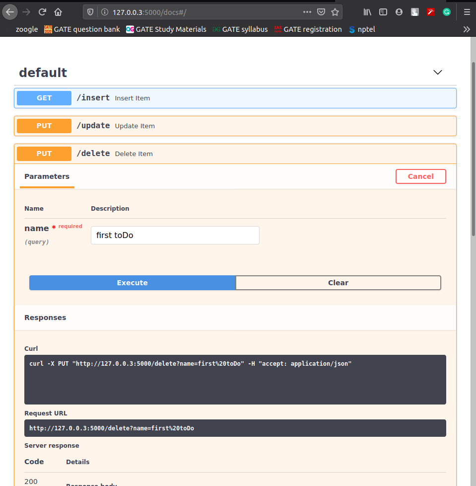
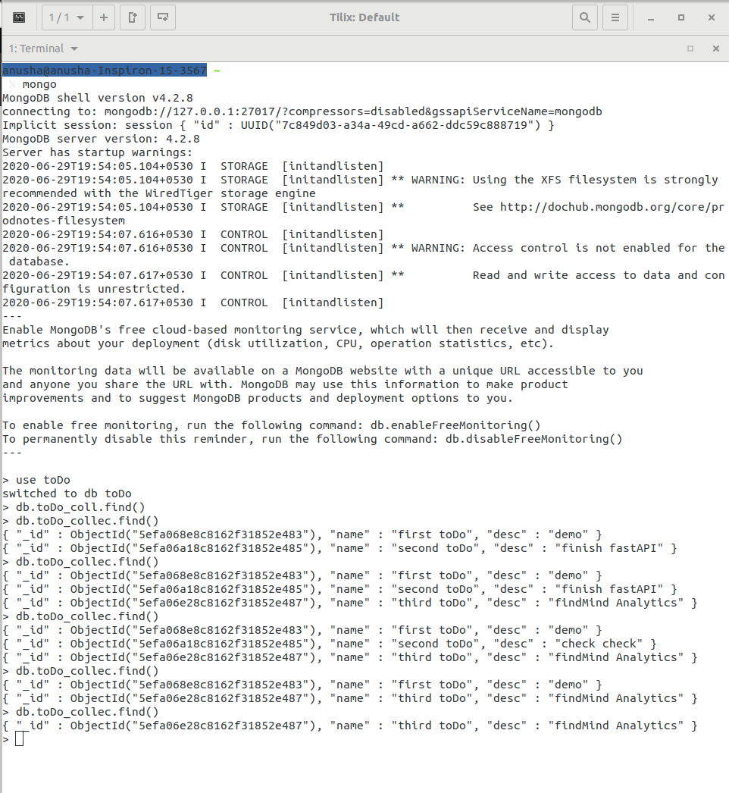

# ToDO_App
A demo ToDo App

keywords:
- Python
- FastAPI
- RestfulAPI
- Motor (MongoDB driver)

Structure:
- name: name of the toDo
- desc: description of the toDo

How to run: 
- open mogoDB and create db `toDo`
- clone the repository
- compile toDo.py
- open: 127.0.0.3/5000/docs

Screenshots:

1. Inserting ToDo

database reflection

2. Update toDo

database reflection

3. Delete toDo

database reflection
