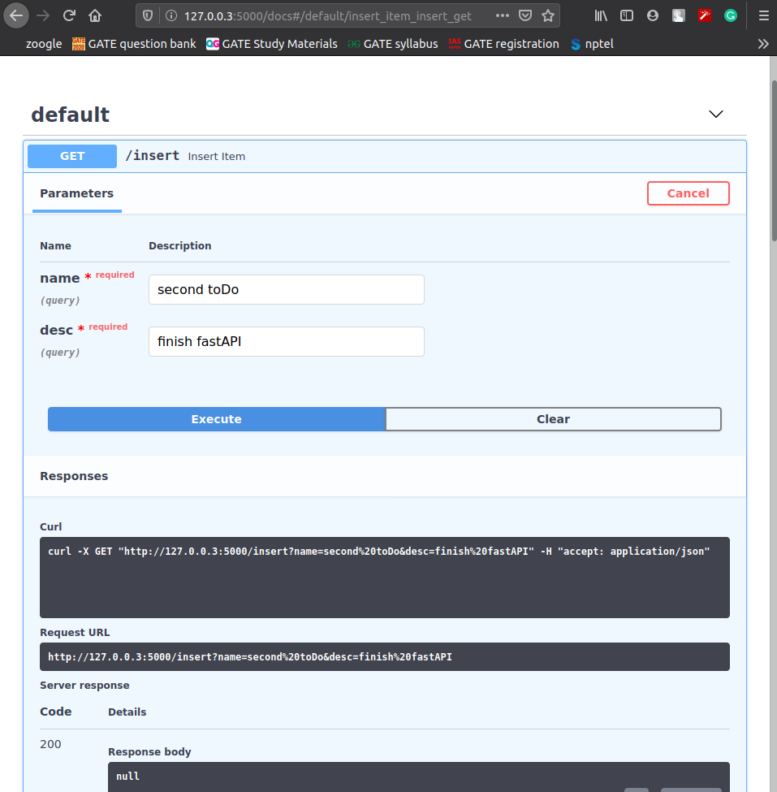
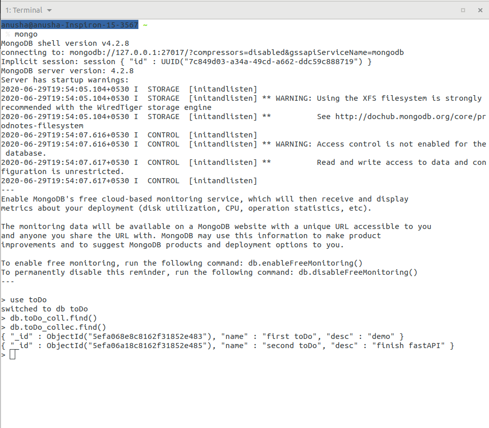
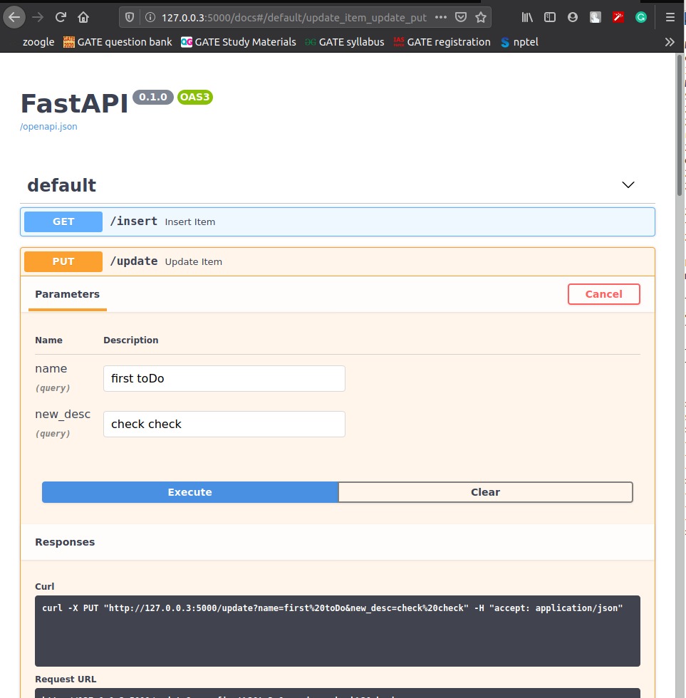
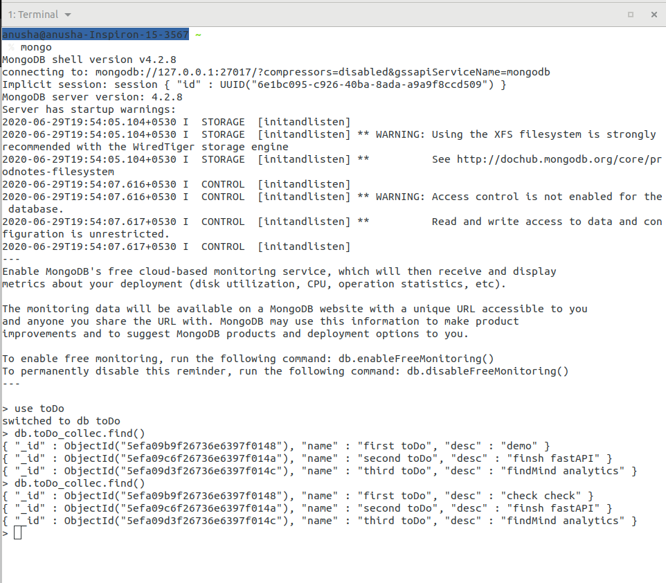
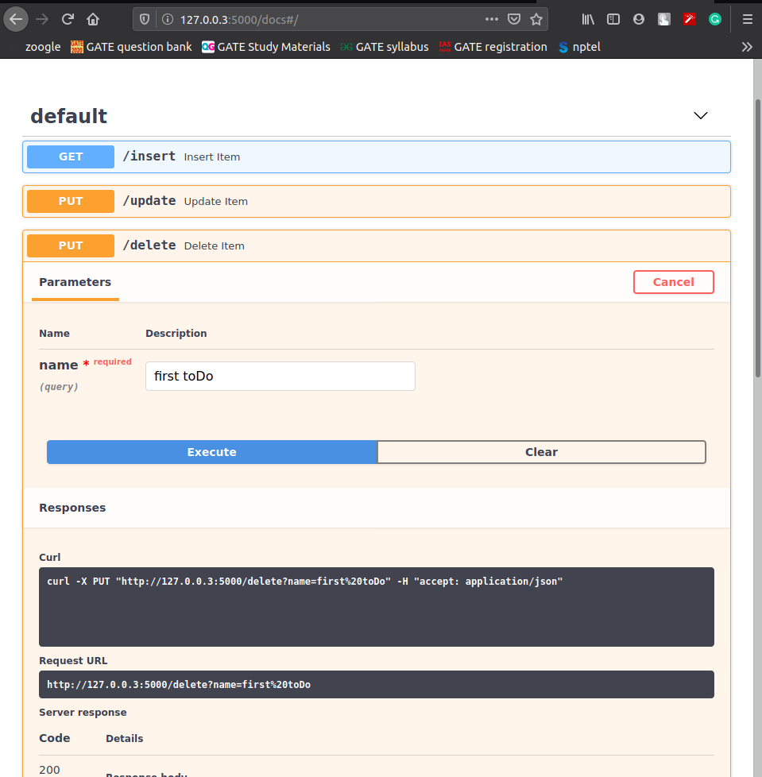
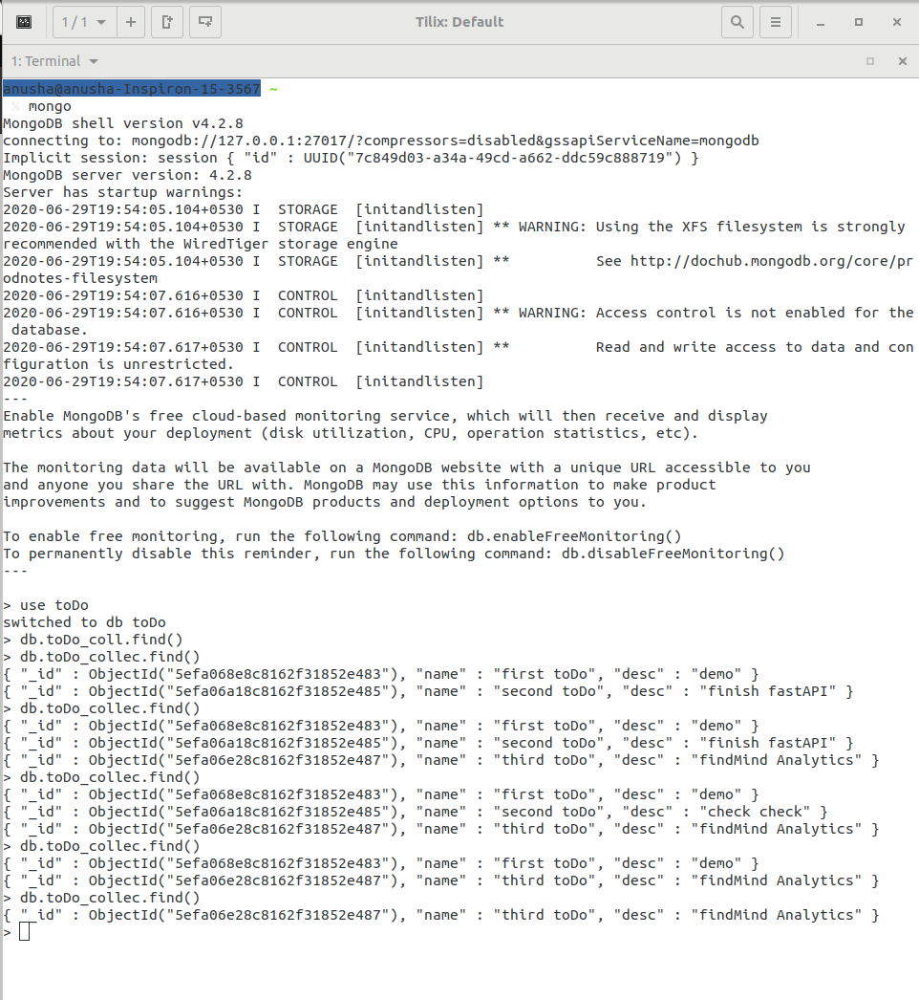

# ToDO_App
A demo ToDo App

keywords:
- Python
- FastAPI
- RestfulAPI
- Motor (MongoDB driver)

Structure:
- name: name of the toDo
- desc: description of the toDo

Screenshots:

1. Inserting ToDo

database reflection

2. Update toDo

database reflection

3. Delete toDo

database reflection
